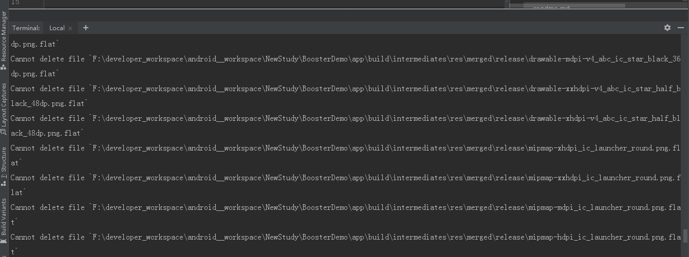
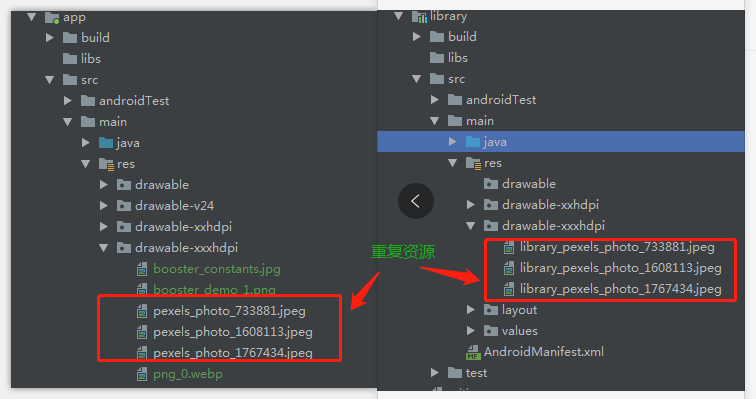
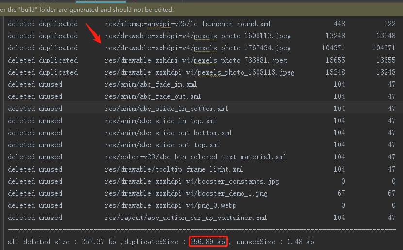
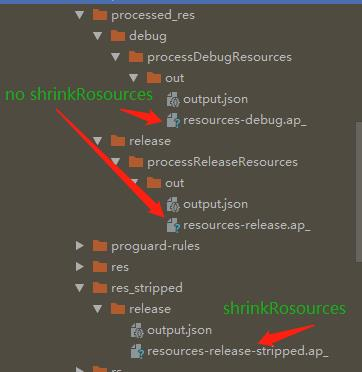
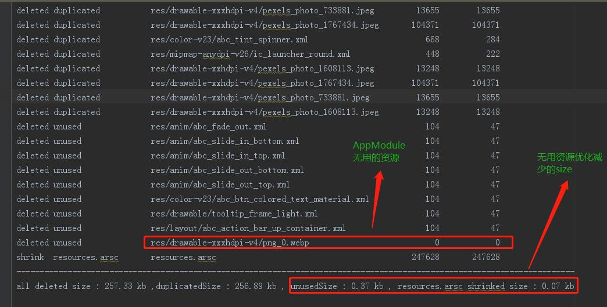

滴滴Booster 内置的资源压缩 task booster-task-compression实现了如下功能：

1.删除冗余资源，保留尺寸最大的图片

2.有损压缩图片资源，内置两种压缩方案：
  
      1.pngquant 有损压缩（需要自行安装 pngquant 命令行工具）
      
      2.cwebp 有损压缩（已内置）


3.修改资源索引文件resources.arsc、webp图片等的zipEntry method，置为DEFLATED，减少压缩包大小

运行demo的时候发现删除冗余资源的时候，console提示删除图片失败，如下图：



win7系统 booster_version = '0.8.0' ，该问题已提[issue#19](https://github.com/didi/booster/issues/39)

Booster对资源索引文件resources.arsc的压缩，只是单一设置ZipEntry.method,这是否运行时性能有影响，有大佬
这样讨论过： [resources.arsc压缩会影响性能吗？](https://github.com/shwenzhang/AndResGuard/issues/84) 、
[Google I/O 2016 笔记：APK 瘦身的正确姿势](https://zhuanlan.zhihu.com/p/21543787)，尚未定论。

针对resources.arsc的优化，美团还提出如下手段：

1.开启资源混淆

2.对重复的资源优化

3.无用资源优化

资源混淆见[微信开源的资源混淆库AndResGuard](https://github.com/shwenzhang/AndResGuard)
 
对重复的资源优化和对被shrinkResources优化掉的资源进行处理的原理见：[美团博客 Android App包瘦身优化实践](https://tech.meituan.com/2017/04/07/android-shrink-overall-solution.html)
 
这里根据美团讲述的原理在Booster定制task实现对重复的资源优化和对无用资源优化，详见工程[module TaskCompression]()。


一、对重复的资源优化

重复资源的筛选条件为 资源的zipEntry.crc相等，最先出现的资源压缩包产物ap_文件是在processResTask中，尽可能早的删除重复资源，
可以减少后续task的执行时间，hook在processResTask之后，如下：
```
variant.processResTask?.doLast{
    variant.removeRepeatResources(it.logger,results)
}
```

这里我按照同zipEntry.crc和同资源目录(不同资源目录可能有相同的crc资源，造成误删，不过可能性较小)去分类收集重复资源：
```
private fun File.findDuplicatedResources():Map<Key,ArrayList<DuplicatedOrUnusedEntry>>{
    var duplicatedResources = HashMap<Key,ArrayList<DuplicatedOrUnusedEntry>>(100)
    ZipFile(this).use { zip ->
        zip.entries().asSequence().forEach { entry ->
            val lastIndex : Int = entry.name.lastIndexOf('/')
            val key = Key(entry.crc.toString(),if(lastIndex == -1) "/" else entry.name.substring(0,lastIndex))
            if(!duplicatedResources.containsKey(key)){
                val list : ArrayList<DuplicatedOrUnusedEntry> = ArrayList(20)
                duplicatedResources[key] = list
            }

            val list = duplicatedResources[key]
            list?.add(DuplicatedOrUnusedEntry(entry.name,entry.size,entry.compressedSize,DuplicatedOrUnusedEntryType.duplicated))

        }
    }

    duplicatedResources.filter {
        it.value.size >= 2
    }.apply{
        duplicatedResources = this as HashMap<Key, ArrayList<DuplicatedOrUnusedEntry>>
    }

    return duplicatedResources
}
```
重复的资源优化的实现整体思路：

1.从ap_文件中解压出resources.arsc条目，并收集该条目的ZipEntry.method,为后续按照同ZipEntry.method
把改动后的resources.arsc添加到ap_文件中

2.收集重复资源

3.根据收集的重复资源，保留重复资源的第一个，从删除ap_文件中删除其他重复资源的zipEntry

4.使用通过[android-chunk-utils]修改resources.arsc全局StringChunk,把这些重复的资源都重定向到没有被删除的第一个资源

5.按照同ZipEntry.method把改动后的resources.arsc添加到ap_文件中

源码见:[doRemoveRepeatResources方法](https://github.com/sihaixuan/BoosterDemo/blob/master/TaskCompression/src/main/java/com/sihaixuan/booster/task/compression/RemoveRepeatResourceVariantProcessor.kt)

验证：
分别在App/lib module显示三张图片，重复资源如下：



查看没集成重复的资源优化的apk，如图：


使用工具查看集成重复的资源优化的apk，如图：


集成重复的资源优化打包，控制和输出报告都可以看到如下输出：



可以知道删除哪些重复资源，压缩包减少了多少kb。


二、无用资源优化

通过shrinkResources true来开启资源压缩，资源压缩工具会把无用的资源替换成预定义的版本而不是移除，
那么google出于什么原因这样做了？ [ResourceUsageAnalyzer](https://android.googlesource.com/platform/tools/base/+/refs/tags/gradle_3.0.0/build-system/gradle-core/src/main/java/com/android/build/gradle/tasks/ResourceUsageAnalyzer.java)
注释是这样说的的：
```
/**
     * Whether we should create small/empty dummy files instead of actually
     * removing file resources. This is to work around crashes on some devices
     * where the device is traversing resources. See http://b.android.com/79325 for more.
     */
```
注释上说了适配解决某些设备crash问题，查看[issue](https://issuetracker.google.com/issues/37010152),发现发生crash的设备基本上都是三星手机，如果删除无用资源，需要考虑该issue问题。


如果采用人工移除的方式会带来后期的维护成本，在Android构建工具执行package${flavorName}Task之前通过修改
Compiled Resources来实现自动去除无用资源。

具体流程如下： * 收集资源包（Compiled Resources的简称）中被替换的预定义版本的资源名称，通过查看资源包
（Zip格式）中每个ZipEntry的CRC-32 checksum来寻找被替换的预定义资源，预定义资源的CRC-32定义在
[ResourceUsageAnalyzer](https://android.googlesource.com/platform/tools/base/+/refs/tags/gradle_3.0.0/build-system/gradle-core/src/main/java/com/android/build/gradle/tasks/ResourceUsageAnalyzer.java)，
下面是它们的定义:
```
	// A 1x1 pixel PNG of type BufferedImage.TYPE_BYTE_GRAY
    public static final long TINY_PNG_CRC = 0x88b2a3b0L;

    // A 3x3 pixel PNG of type BufferedImage.TYPE_INT_ARGB with 9-patch markers
    public static final long TINY_9PNG_CRC = 0x1148f987L;

    // The XML document <x/> as binary-packed with AAPT
    public static final long TINY_XML_CRC = 0xd7e65643L;
    
    // The XML document <x/> as a proto packed with AAPT2
    public static final long TINY_PROTO_XML_CRC = 3204905971L;
```
从定义中没有看到webp、jpg、jpeg相关的crc，那么这些没有定义crc-32的资源在ZipEntry中crc为多少了，用预定义资源替换未使用的地方的实现如下：

```
private void replaceWithDummyEntry(JarOutputStream zos, ZipEntry entry, String name)throws IOException {
        // Create a new entry so that the compressed len is recomputed.
        byte[] bytes;
        long crc;
        if (name.endsWith(DOT_9PNG)) {
            bytes = TINY_9PNG;
            crc = TINY_9PNG_CRC;
        } else if (name.endsWith(DOT_PNG)) {
            bytes = TINY_PNG;
            crc = TINY_PNG_CRC;
        } else if (name.endsWith(DOT_XML)) {
            switch (format) {
                case BINARY:
                    bytes = TINY_BINARY_XML;
                    crc = TINY_BINARY_XML_CRC;
                    break;
                case PROTO:
                    bytes = TINY_PROTO_XML;
                    crc = TINY_PROTO_XML_CRC;
                    break;
                default:
                    throw new IllegalStateException("");
            }
        } else {
            //没有预定资源格式，crc =0,数据为空
            bytes = new byte[0];
            crc = 0L;
        }
        JarEntry outEntry = new JarEntry(name);
        if (entry.getTime() != -1L) {
            outEntry.setTime(entry.getTime());
        }
        if (entry.getMethod() == JarEntry.STORED) {
            outEntry.setMethod(JarEntry.STORED);
            outEntry.setSize(bytes.length);
            outEntry.setCrc(crc);
        }
        zos.putNextEntry(outEntry);
        zos.write(bytes);
        zos.closeEntry();

        ...
    }
```
可以得出筛选无使用资源的条件为crc in如下集合中：

```
val unusedResourceCrcs  = longArrayOf(
    ResourceUsageAnalyzer.TINY_PNG_CRC,
    ResourceUsageAnalyzer.TINY_9PNG_CRC,
    ResourceUsageAnalyzer.TINY_BINARY_XML_CRC,
    ResourceUsageAnalyzer.TINY_PROTO_XML_CRC,
    0 //jpg、jpeg、webp等
)
```
如果集成了

打印packageAndroidTask的inputFiles，如下：


分别查看箭头目录下的文件，有*.ap_文件，



而从上面两图中可以了解到shrinkResources 影响到packageAndroidTask的inputFiles，没有开启shrinkResources，
packageAndroidTask从processedResTask产物中读取ap_文件，开启shrinkResources，从res_stripped目录下读取ap_文件,
根据其stripped名，也猜测出ap_文件中已经进行了预定资源替换未使用资源了，可以压缩软件查看未使用资源的zipEntry.crc
进行验证，如下图：


可以看到没有使用的webp、jpg资源的ZipEntry.crc为0;如果集成了Booster内置的booster-task-compression，
会把png格式转换成webp格式，没使用的png最后的crc会变为0.

删除无用资源方案想到两种：

方案一：删除所有无用资源文件，以及删除资源索引文件resources.arsc中global StringChunk有关无用资源的数据项。

缺点：删除了global StringChunk中的数据项，改变了后续数据项的索引值，好比删除List中的元素，后续的元素索引值减一一样，牵一发动全身，需要同步其他chunk索引到global StringChunk数据项的索引值。否则会出现资源显示混乱，甚至crash；同时需要考虑上述issue问题。对resources.arsc越大出现问题的概率越大

 

方案二：无用资源根据crc分类，再按照重复资源优化，没有删除global StringChunk数据项，没有改变数据项的索引值，不需要改动其他chunk,同时不会出现上述issue问题。

 

下面对方案二具体实现，方案一就不做讨论了。

无用资源优化的代码实现整体思路：

1.从ap_文件中解压出resources.arsc条目，并收集该条目的ZipEntry.method,为后续按照同ZipEntry.method 把改动后的resources.arsc添加到ap_文件中

2.收集无用资源

3.把收集的无用资源根据crc进行分类，在按照重复资源优化处理


源码见:[doRemoveUnusedResources方法](https://github.com/sihaixuan/BoosterDemo/blob/master/TaskCompression/src/main/java/com/sihaixuan/booster/task/compression/RemoveRepeatResourceVariantProcessor.kt)

集成无用资源优化打包，控制和输出报告都可以看到如下输出：



可以知道删除哪些无用资源，压缩包减少了多少kb，无用资源优化减少的size没多少。


以上重复资源优化和无用资源优化，没有经过大量设备测试，仅供参考学习。


推荐阅读：

[滴滴Booster移动App质量优化框架-学习之旅 一](https://mp.weixin.qq.com/s/4VfomVeDKGeeMa9p-76Cyw)

[Android 模块Api化演练](https://mp.weixin.qq.com/s/jffUBZct_toJ-TxUZ6Ttcg)

[不一样视角的Glide剖析(一)](https://mp.weixin.qq.com/s/el0IMGn75QtdPTBk7f5DbA)


关注公众号：


